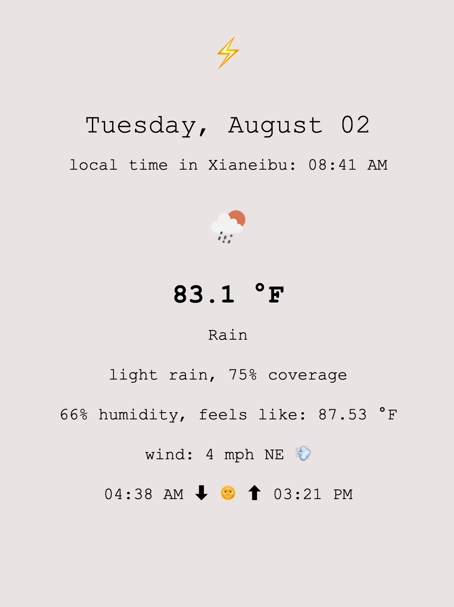

## a simple weather webapp

>> purpose: practice html/css, use `Net::Http` to request info a weather api, interact with an api

- useful coordinate gem: [geocoder](https://github.com/alexreisner/geocoder) from: alexreisner
- ruby library used to issue http request: `require 'net/http'`
- all weather info is sourced from [openweathermap.org](https://openweathermap.org/current) with a free tier subscription; currently limited to info on the weather RIGHT NOW, no forecasting unfortunately
- had a lot of fun with this very simple app; will probably later on expand functionality

